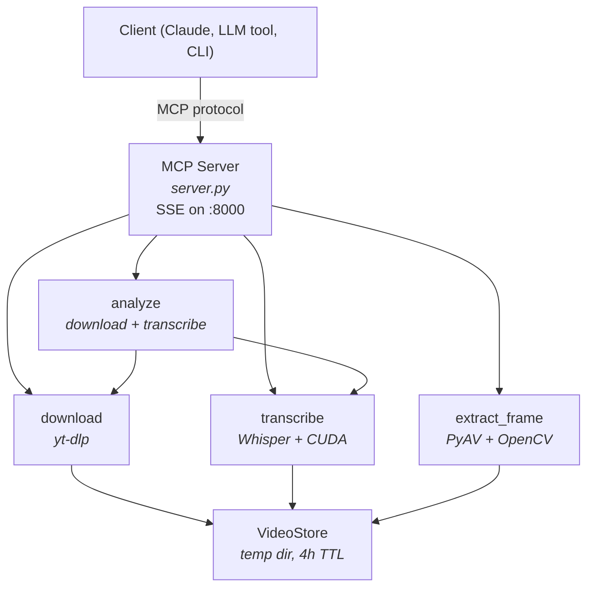

# Video Decomposer

An MCP server for video decomposition: download videos, transcribe audio with OpenAI Whisper (CUDA-accelerated), and extract key frames. Runs as an HTTP MCP server on a machine with an NVIDIA GPU, and includes a CLI for local use.

## Features

- **Video download** via yt-dlp -- supports YouTube, Facebook, Instagram, and [1,000+ other sites](https://github.com/yt-dlp/yt-dlp/blob/master/supportedsites.md)
- **Audio transcription** with OpenAI Whisper, with automatic CUDA acceleration when a GPU is available
- **Frame extraction** at arbitrary timestamps, returned as base64-encoded JPEGs with configurable resolution and quality
- **Combined analysis** workflow that downloads and transcribes in one call
- **Docker image** with GPU passthrough, hardware-accelerated FFmpeg (NVDEC/NVENC), and persistent caching
- **Automatic cleanup** of downloaded videos after 4 hours

## Prerequisites

**For Docker (recommended):**

- Docker and Docker Compose
- NVIDIA GPU with drivers installed
- [NVIDIA Container Toolkit](https://docs.nvidia.com/datacenter/cloud-native/container-toolkit/latest/install-guide.html)

**For local development:**

- Python 3.12
- [uv](https://docs.astral.sh/uv/) package manager
- NVIDIA GPU + CUDA drivers (for GPU-accelerated transcription)
- FFmpeg

## Quick Start

```bash
# Start the MCP server with GPU support
docker compose up --build

# In another terminal, test with mcp-remote
npx mcp-remote http://localhost:8000/sse
```

Or use the CLI directly:

```bash
uv sync
uv run cli analyze https://www.youtube.com/watch?v=dQw4w9WgXcQ
```

## MCP Tools

The server exposes four tools over the MCP protocol:

| Tool               | Parameters                                            | Returns                             | Description                                                                 |
| ------------------ | ----------------------------------------------------- | ----------------------------------- | --------------------------------------------------------------------------- |
| `download_video`   | `url`                                                 | `video_id` (string)                 | Download a video. Returns an ID for use with other tools.                   |
| `transcribe_video` | `video_id`, `model?`                                  | `{text, segments}`                  | Transcribe audio to text. Segments include start/end timestamps in seconds. |
| `extract_frame`    | `video_id`, `timestamp`, `max_dimension?`, `quality?` | `{type, data, mimeType, timestamp}` | Extract a single frame as a base64-encoded JPEG.                            |
| `analyze_video`    | `url`, `whisper_model?`                               | `{video_id, transcript}`            | Download + transcribe in one call. Best starting point for video analysis.  |

**`analyze_video`** is the recommended entry point -- it downloads the video and returns a transcript with timestamped segments. Use the returned `video_id` and segment timestamps with `extract_frame` to see what was on screen at specific moments.

## CLI Usage

The CLI provides the same capabilities as the MCP server for local use:

```bash
# Preload a Whisper model (useful for warming up)
uv run cli preload turbo

# Download a video and get its ID
uv run cli download "<url>"

# Transcribe a downloaded video
uv run cli transcribe abc123def456

# Extract a frame at 30.5 seconds
uv run cli extract-frame abc123def456 30.5 --output-dir ./frames

# Download and transcribe in one step
uv run cli analyze "<url>"
```

## Whisper Models

The `model` / `whisper_model` parameter controls the specific Whisper model used for transcription:

| Model    | Parameters | Relative Speed | VRAM Required | Notes                                 |
| -------- | ---------- | -------------- | ------------- | ------------------------------------- |
| `turbo`  | 809M       | ~8x            | ~6 GB         | Default. Best speed/quality tradeoff. |
| `base`   | 74M        | ~16x           | ~1 GB         | Fast, lower accuracy.                 |
| `small`  | 244M       | ~6x            | ~2 GB         | Moderate quality.                     |
| `medium` | 769M       | ~2x            | ~5 GB         | Good quality, slower.                 |
| `large`  | 1550M      | 1x             | ~10 GB        | Best quality, slowest.                |

Whisper supports many languages, but English has the best accuracy; for non-English audio, `large` may produce better results.

## Architecture

The server is built with [FastMCP](https://github.com/modelcontextprotocol/python-sdk) and delegates to tool modules that wrap [yt-dlp](https://github.com/yt-dlp/yt-dlp), [OpenAI Whisper](https://github.com/openai/whisper), [PyAV](https://github.com/pyav-org/pyav), and [OpenCV](https://opencv.org/). All blocking operations (downloading, transcription, frame extraction) run via `asyncio.run_in_executor()` to keep the async event loop responsive.

A `VideoStore` manages downloaded videos on disk, keyed by short hex IDs. Videos expire after 4 hours, and a background cleanup loop runs every 10 minutes.



## Docker and mcp-remote

### Running the server with Docker Compose

The included `docker-compose.yml` runs the MCP server with NVIDIA GPU passthrough and persistent volumes for the Whisper model cache and downloaded videos:

```bash
docker compose up --build
```

This builds a multi-stage Docker image that includes:

- NVIDIA CUDA 12.4 runtime
- FFmpeg 8.0.1 compiled with NVDEC/NVENC support
- All Python dependencies with PyTorch CUDA 12.4 wheels

The server listens on port 8000. Whisper models are cached in `./whisper_cache` and downloaded videos are stored in `./video_store`, both persisted across container restarts.

### Connecting with mcp-remote

[mcp-remote](https://github.com/geelen/mcp-remote) bridges an HTTP/SSE MCP server to the stdio transport that most LLM tools expect. This lets you use Video Decomposer with any MCP-compatible client:

```bash
npx mcp-remote http://YOUR_HOST:8000/sse
```

Replace `YOUR_HOST` with the hostname or IP of the machine running the server.

### Claude Desktop configuration

Add this to your `claude_desktop_config.json` to make Video Decomposer available in Claude Desktop:

```json
{
  "mcpServers": {
    "video-decomposer": {
      "command": "npx",
      "args": ["mcp-remote", "http://YOUR_HOST:8000/sse"]
    }
  }
}
```

This works with any MCP client that supports stdio servers.

## Local Development

```bash
# Install dependencies
uv sync

# Run the test suite (enforces 100% code coverage)
uv run pytest

# Start the MCP server locally
uv run server
```

Python 3.12 is required. PyTorch is installed from the CUDA 12.4 index configured in `pyproject.toml`.

## Configuration

| Variable           | Default         | Description                                                         |
| ------------------ | --------------- | ------------------------------------------------------------------- |
| `VIDEO_STORE_PATH` | `./video_store` | Directory for downloaded video files                                |
| `LOG_LEVEL`        | `INFO`          | Logging verbosity (`DEBUG`, `INFO`, `WARNING`, `ERROR`, `CRITICAL`) |

Downloaded videos are automatically cleaned up after 4 hours.

## License

See [LICENSE.md](LICENSE.md).
