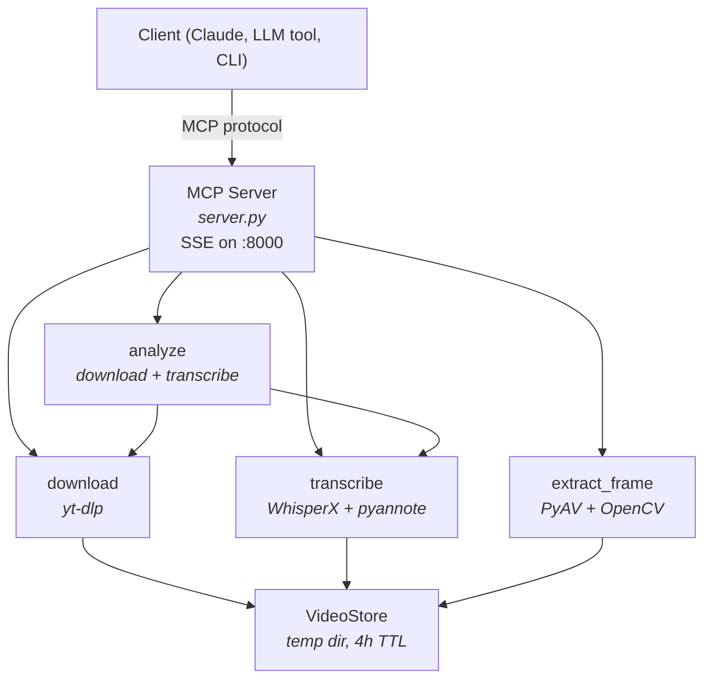

# Video Decomposer <!-- omit in toc -->

An MCP server for video decomposition: download videos, transcribe audio, identify speakers, and extract key frames. Runs as an HTTP MCP server and includes a CLI for local use.

- [Features](#features)
- [Prerequisites](#prerequisites)
- [Quick Start](#quick-start)
- [MCP Tools](#mcp-tools)
- [CLI Usage](#cli-usage)
- [Whisper Models](#whisper-models)
- [Architecture](#architecture)
- [Docker and mcp-remote](#docker-and-mcp-remote)
  - [Building and running with Docker](#building-and-running-with-docker)
  - [Running from a pre-built image](#running-from-a-pre-built-image)
  - [Connecting with mcp-remote](#connecting-with-mcp-remote)
  - [Claude Desktop configuration](#claude-desktop-configuration)
- [Local Development](#local-development)
- [Configuration](#configuration)
  - [Environment Variables](#environment-variables)
  - [Volume Mounts](#volume-mounts)
- [License](#license)

## Features

- **Video download** via yt-dlp; supports YouTube, Facebook, Instagram, and [1,000+ other sites](https://github.com/yt-dlp/yt-dlp/blob/master/supportedsites.md)
- **Audio transcription** with [WhisperX](https://github.com/m-bain/whisperX) (faster-whisper backend), with CUDA acceleration when a GPU is available
- **Speaker diarization** via [pyannote.audio](https://github.com/pyannote/pyannote-audio) — identifies who is speaking in each segment (opt-in via `diarize_speakers`, requires `HF_TOKEN`). Diarization is useful for multi-speaker videos but may occasionally misattribute segments or split a single speaker across multiple labels; review the output if accuracy is critical.
- **Frame extraction** at arbitrary timestamps, returned as native MCP image content with configurable resolution and quality
- **Combined analysis** workflow that downloads and transcribes in one call, with optional diarization
- **Docker image** with GPU passthrough, hardware-accelerated FFmpeg (NVDEC/NVENC), and persistent caching
- **Automatic cleanup** of downloaded videos after 4 hours

## Prerequisites

**For Docker (recommended):**

- Docker and Docker Compose
- NVIDIA GPU with drivers installed
- [NVIDIA Container Toolkit](https://docs.nvidia.com/datacenter/cloud-native/container-toolkit/latest/install-guide.html)

**For local development:**

- Python 3.12
- [uv](https://docs.astral.sh/uv/) package manager
- NVIDIA GPU + CUDA drivers (for GPU-accelerated transcription)
- FFmpeg
- A [Hugging Face access token](https://huggingface.co/settings/tokens) (`HF_TOKEN`) with accepted conditions for [pyannote/speaker-diarization-3.1](https://huggingface.co/pyannote/speaker-diarization-3.1) (required for speaker diarization)

## Quick Start

```bash
# Set up environment
cp .env.example .env
# edit .env to add HF_TOKEN for speaker diarization model

# Build the Docker images locally (CUDA variant by default)
./build-local.sh

# Start the MCP server
docker compose up

# In another terminal, test with mcp-remote
npx -y mcp-remote http://localhost:8000/sse
```

Or use the CLI directly:

```bash
uv sync
uv run cli analyze https://www.youtube.com/watch?v=dQw4w9WgXcQ
```

## MCP Tools

The server exposes four tools over the MCP protocol:

| Tool               | Parameters                                                           | Returns                  | Description                                                                 |
| ------------------ | -------------------------------------------------------------------- | ------------------------ | --------------------------------------------------------------------------- |
| `download_video`   | `url`                                                                | `video_id` (string)      | Download a video. Returns an ID for use with other tools.                   |
| `transcribe_video` | `video_id`, `whisper_model?`, `diarize_speakers?`, `align_language?` | `{text, segments}`       | Transcribe audio. Optionally identify speakers with `diarize_speakers`.     |
| `extract_frame`    | `video_id`, `timestamp`, `max_dimension?`, `quality?`                | MCP image content (JPEG) | Extract a single frame as a JPEG image (max 768px longest edge by default). |
| `analyze_video`    | `url`, `whisper_model?`, `diarize_speakers?`, `align_language?`      | `{video_id, transcript}` | Download + transcribe in one call. Best starting point for video analysis.  |

**`analyze_video`** is the recommended entry point; it downloads the video and returns a transcript with timestamped segments. Use the returned `video_id` and segment timestamps with `extract_frame` to see what was on screen at specific moments.

## CLI Usage

The CLI provides the same capabilities as the MCP server for local use:

```bash
# Download a video and get its ID
uv run cli download "<url>"

# Transcribe a downloaded video
uv run cli transcribe abc123def456

# Extract a frame at 30.5 seconds
uv run cli extract-frame abc123def456 30.5 --output-dir ./frames

# Download and transcribe in one step
uv run cli analyze "<url>"
```

## Whisper Models

The `whisper_model` parameter controls the specific Whisper model used for transcription:

| Model    | Parameters | Relative Speed | VRAM Required | Notes                                 |
| -------- | ---------- | -------------- | ------------- | ------------------------------------- |
| `turbo`  | 809M       | ~8x            | ~6 GB         | Default. Best speed/quality tradeoff. |
| `base`   | 74M        | ~16x           | ~1 GB         | Fast, lower accuracy.                 |
| `small`  | 244M       | ~6x            | ~2 GB         | Moderate quality.                     |
| `medium` | 769M       | ~2x            | ~5 GB         | Good quality, slower.                 |
| `large`  | 1550M      | 1x             | ~10 GB        | Best quality, slowest.                |

Whisper supports many languages, but English has the best accuracy; for non-English audio, `large` may produce better results.

## Architecture

The server is built with [FastMCP](https://github.com/modelcontextprotocol/python-sdk) and delegates to tool modules that wrap [yt-dlp](https://github.com/yt-dlp/yt-dlp), [WhisperX](https://github.com/m-bain/whisperX) (faster-whisper + pyannote.audio), [PyAV](https://github.com/pyav-org/pyav), and [OpenCV](https://opencv.org/). All blocking operations (downloading, transcription, diarization, frame extraction) run via `asyncio.run_in_executor()` to keep the async event loop responsive.

A `VideoStore` manages downloaded videos on disk, keyed by short hex IDs. Videos expire after 4 hours, and a background cleanup loop runs every 10 minutes. Transcription, alignment, and speaker diarization results are cached as JSON files in each video's directory. Repeated calls with the same parameters skip the expensive GPU computation. Long-running tools report progress via MCP progress notifications to prevent client timeouts.



## Docker and mcp-remote

### Building and running with Docker

Build the base image (FFmpeg + PyAV) and app image locally:

```bash
# CUDA variant (default)
./build-local.sh

# Or CPU-only variant
./build-local.sh cpu
```

The base image (`Dockerfile.base`) contains FFmpeg compiled with NVDEC/NVENC and PyAV built from source. It rarely changes and only needs rebuilding when FFmpeg or PyAV versions are bumped. The app image (`Dockerfile`) layers Python dependencies and source on top.

Then start the server:

```bash
docker compose up
```

The server listens on port 8000. Downloaded videos are stored in `./video_store`, persisted across container restarts.

> [!NOTE]
> **GPU compatibility:** The default configuration uses CUDA 12.8 PyTorch wheels, which support NVIDIA GPUs from Maxwell (sm_50) through Blackwell (sm_120). If you have an older or newer GPU architecture that isn't supported, update the `pytorch-cu128` index URL in `pyproject.toml` to the appropriate version from [PyTorch's install page](https://pytorch.org/get-started/locally/) and update the CUDA base images in `Dockerfile.base` to match.

### Running from a pre-built image

Pre-built images are published to GHCR in two variants:

| Tag suffix | Description                | Example                                                |
| ---------- | -------------------------- | ------------------------------------------------------ |
| `-cu128`   | CUDA 12.8 with GPU support | `ghcr.io/icooper/video-decomposer-mcp:<version>-cu128` |
| `-cpu`     | CPU-only (no GPU required) | `ghcr.io/icooper/video-decomposer-mcp:<version>-cpu`   |

**With an NVIDIA GPU:**

```bash
docker run --gpus all -p 8000:8000 \
  -v ./video_store:/app/video_store \
  ghcr.io/icooper/video-decomposer-mcp:<version>-cu128
```

**CPU-only:**

```bash
docker run -p 8000:8000 \
  -v ./video_store:/app/video_store \
  ghcr.io/icooper/video-decomposer-mcp:<version>-cpu
```

> [!NOTE]
> Replace `<version>` with a specific release (e.g., `1.2.0` or `1.2`). Don't use `latest`. See [video-decomposer-mcp packages](https://github.com/icooper/video-decomposer-mcp/pkgs/container/video-decomposer-mcp) for available versions.

### Connecting with mcp-remote

[mcp-remote](https://github.com/geelen/mcp-remote) bridges an HTTP/SSE MCP server to the stdio transport that most LLM tools expect. This lets you use Video Decomposer with any MCP-compatible client:

```bash
npx -y mcp-remote http://YOUR_HOST:8000/sse
```

Replace `YOUR_HOST` with the hostname or IP of the machine running the server.

### Claude Desktop configuration

Add this to your `claude_desktop_config.json` to make the video decomposer tools available in Claude Desktop:

```json
{
  "mcpServers": {
    "video-decomposer": {
      "command": "npx",
      "args": ["-y", "mcp-remote", "http://YOUR_HOST:8000/sse"]
    }
  }
}
```

A similar approach should work with any other MCP client that supports stdio servers.

## Local Development

```bash
# Install dependencies
uv sync

# Run the test suite (enforces 100% code coverage)
uv run pytest

# Start the MCP server locally
uv run server
```

Python 3.12 is required. PyTorch is installed from the CUDA 12.8 index configured in `pyproject.toml`.

## Configuration

### Environment Variables

| Variable                               | Default     | Description                                                         |
| -------------------------------------- | ----------- | ------------------------------------------------------------------- |
| `HF_TOKEN`                             | _(none)_    | Hugging Face access token for pyannote.audio speaker diarization    |
| `LOG_LEVEL`                            | `INFO`      | Logging verbosity (`DEBUG`, `INFO`, `WARNING`, `ERROR`, `CRITICAL`) |
| `MCP_HOST`                             | `127.0.0.1` | Host address the MCP server binds to                                |
| `MCP_PORT`                             | `8000`      | Port the MCP server listens on                                      |
| `PRELOAD_ALIGN_LANGUAGE`               | `en`        | Language for the alignment model preloaded at startup               |
| `VIDEO_STORE_TTL_SECONDS`              | `14400`     | Video expiration time in seconds (defaults to 4 hours)              |
| `VIDEO_STORE_CLEANUP_INTERVAL_SECONDS` | `600`       | Cleanup loop interval in seconds (defaults to 10 minutes)           |
| `WHISPER_MODEL`                        | `turbo`     | Default Whisper model to preload and use                            |

### Volume Mounts

These paths within the container can be assigned to Docker volumes to persist data across container restarts.

| Container Path     | Description                                                                                                                          |
| ------------------ | ------------------------------------------------------------------------------------------------------------------------------------ |
| `/app/hf_cache`    | HuggingFace cache, used for transcription and speaker diarization models. Mount to avoid re-downloading models on container restart. |
| `/app/nltk_data`   | NLTK tokenizer data. Mount to avoid re-downloading on container restart.                                                             |
| `/app/video_store` | Downloaded videos and cached transcription results. Mount to persist across container restarts.                                      |

> [!TIP]
> - Assigning `/app/hf_cache` to a volume is beneficial as it removes the need to re-download the models for transcription and speaker diarization every time the container starts.
> - The default `docker-compose.yml` exposes all GPUs (`device_ids: ["all"]`). To limit to specific GPUs, edit the `device_ids` list (e.g., `["0"]` or `["0", "1"]`).

## License

See [LICENSE.md](./LICENSE.md).
